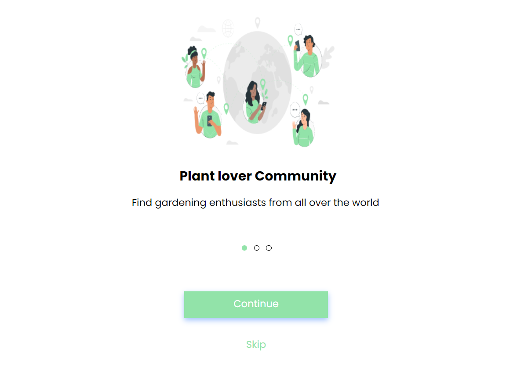
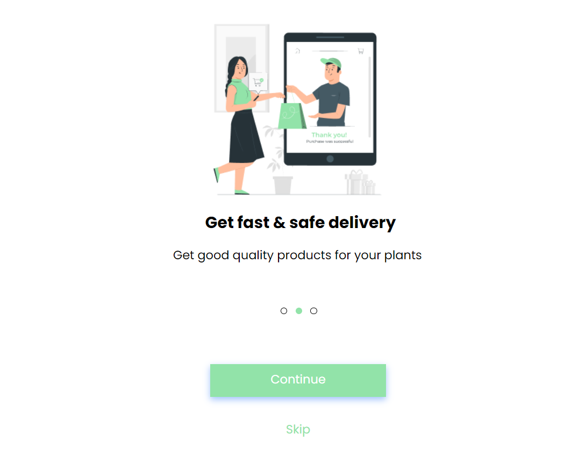
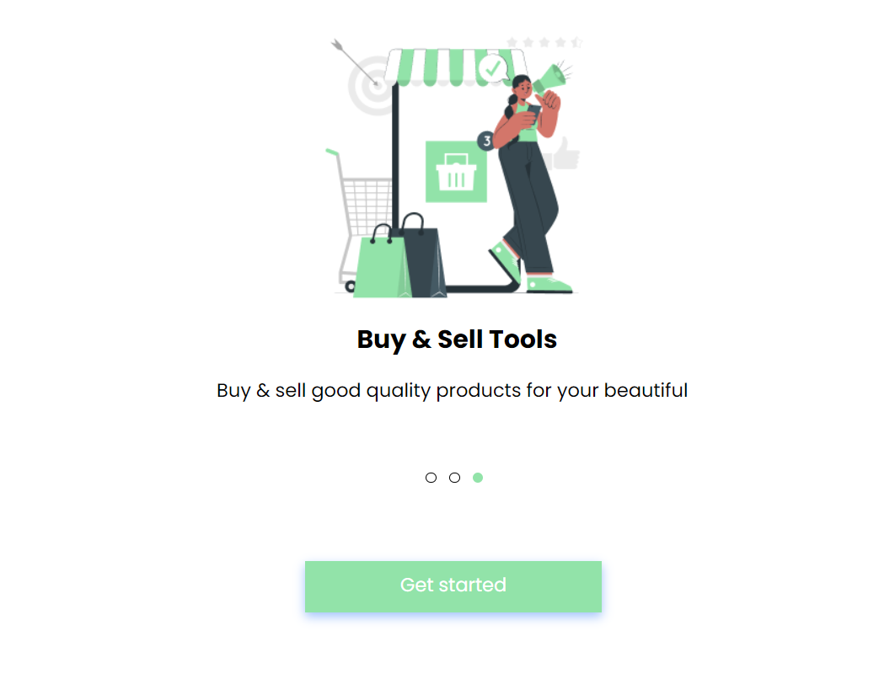

## Project Onboarding - Sprint 1

Projeto front end de páginas responsivas que interagem por meio de botões next e skip.

## Technology 

Here are the technologies used in this project.

* HTML5
* CSS3

## Services Used

* Github
* Visual Studio Code

## How to use

### 1 -  Ao acessar você verá a primeira página,  clique em "Continue" para ir para a segunda página ou "Skip" para ir para a última.

### 2 - Ao acessar a segunda página,  clique "Continue"  ou "Skip" para ir para a última.

### 3 - Na terceira página clique "Get started" para começar!

### 4 - Use em seu desktop ou celular. Páginas responsivas!

## Features

 - Responsividade
 - Botões Next e Skip

  ## Authors

  * **Jenyffer Bastos Sacramento**
